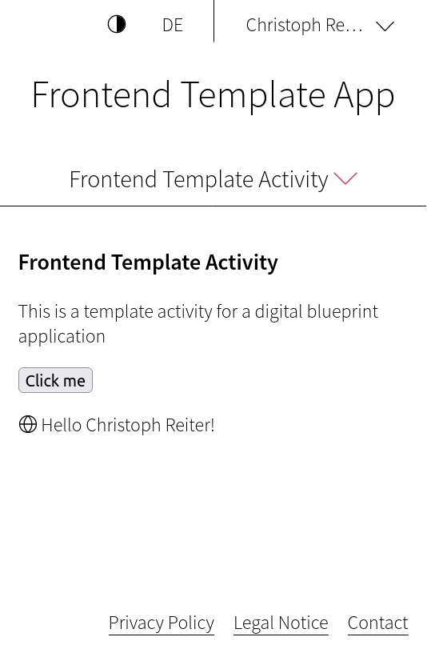

# Overview

The DBP frontend framework is a web component based micro frontend framework
with the goal to provide re-usable, self contained UI components, that are not
tied to a particular frontend technology, which can be easily integrated into
any existing website without conflicting with any other components or
technologies. In addition it provides all the components needed to build full
features web applications with state management, login handling, client side
routing, and more.

{: style="max-width:250px; width: 100%; border: 1px solid #aaa" }

For example including a library checkout widget into a wiki page, or a typo3
served page without needing to modify the wiki or typo3 backend and without
interfering with it in anyway.

We don't want to reinvent the world so we try to use existing standard where we
can. So the goal for this documentation is to keep it small.

## Javascript Libraries

Despite our goal to not hard-depend on a specific Javascript framework we use a
common set of helper libraries which we have found useful. We try to not make
them leak out any internals so we can switch to different ones in the future.

* [lit](https://lit.dev/): Makes writing web components easier.

* [i18next](https://www.i18next.com): Handles translations and
  internationalization.

* [@open-wc/scoped-elements](https://open-wc.org/docs/development/scoped-elements):
  Namespaces internal web components so they don't leak out.